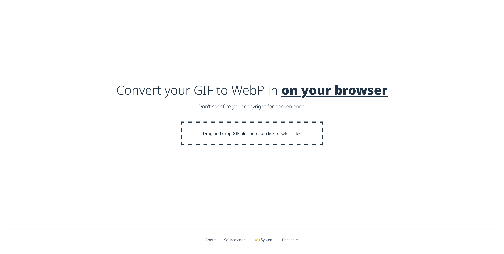

[gif2webp.com](https://gif2webp.com)
====================================

gif2webp.com is a simple webapp to convert GIF to WebP easily in user's browser without sending file to server.



## Build

First, you have to install dependencies:

```
yarn
```

Or with following options:

```
yarn install --immutable
```

------

Build `@gif2webp/image-converter` first with following command:

```
yarn workspace @gif2webp/image-converter build
```

Run `yarn dev` command in `packages/frontend` or run following command:

```
yarn workspace @gif2webp/frontend dev
```

## Storybook

To view and test UI components in isolation:

```bash
# Run Storybook development server
yarn workspace @gif2webp/frontend storybook

# Build Storybook for production
yarn workspace @gif2webp/frontend build-storybook
```

Storybook will be available at http://localhost:6006
